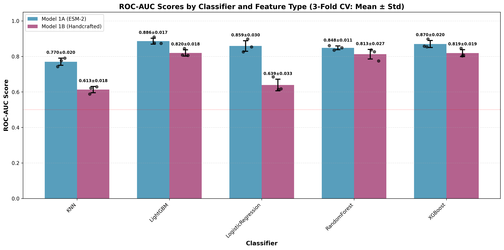
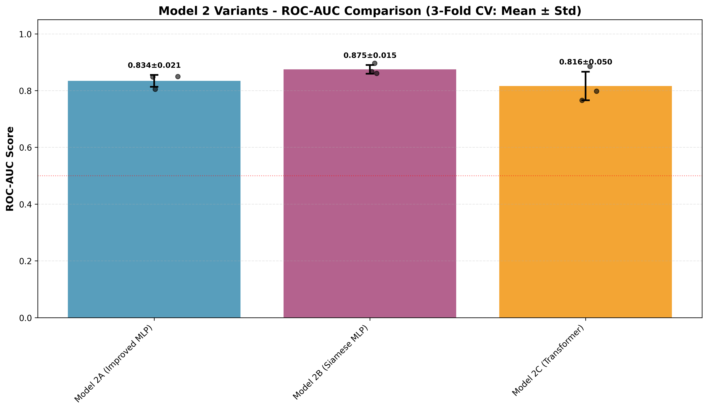
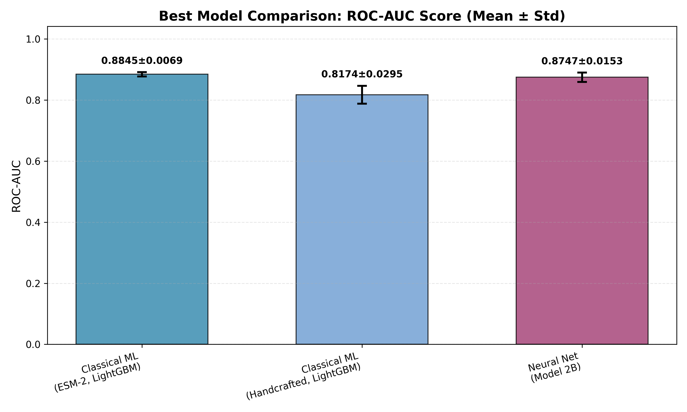

# 🔬 Protein–Protein Interaction (PPI) Prediction  
### *A rigorous, production-grade pipeline combining classical ML, deep learning on embeddings, and LoRA-fine-tuned protein language models.*

---

## 📌 **TL;DR — What This Repository Achieves**
- Implements **strict protein-disjoint cross-validation** (no transductive leakage).  
- Trains **three families of models**:  
  1. Classical ML on ESM-2 embeddings  
  2. Neural models on frozen embeddings (MLP, Siamese, Transformer)  
  3. **LoRA fine-tuning of ProtBERT-BFD and ESM-2** using a **bi-encoder architecture** (implementation ready)
- **Best result:** LightGBM on ESM-2 embeddings achieves **ROC-AUC 0.8861 ± 0.0166** on fully protein-disjoint 3-fold CV.  
- Provides reproducible scripts for data generation, feature extraction, training, and evaluation.

---

# 🧬 1. Background & Motivation

Protein–protein interactions (PPIs) underlie virtually all cellular processes. As sequence-only computational prediction improves, protein language models (PLMs) have emerged as powerful tools for capturing structural and functional information without explicit structural data.

**Goal of this project:**  
> Given two raw protein sequences \( A \) and \( B \), predict whether they interact (binary classification).

This project was developed as part of a bioinformatics technical challenge. It recreates a **modern PPI prediction pipeline** using transformer-based PLMs and strict evaluation methodology.

---

# 🚨 2. Avoiding Data Leakage: Protein-Disjoint CV

### Why normal random splitting is wrong
In most PPI datasets, proteins appear in many pairs:

```
Train: (A, X), (B, Y), (A, Z)  
Test:  (A, Q)
```

Even though the pairs differ, the **identity of protein A leaks into the test set** — embeddings of A are already seen during training.

This leads to **inflated performance**.

### ✔ The correct split: protein-disjoint CV

We split **proteins**, not pairs:

```
Proteins: [P1, P2, P3, ..., Pn]
             |            |
         Train IDs    Test IDs

Train pairs = (A, B) only if A ∈ TrainIDs AND B ∈ TrainIDs
Test pairs  = (A, B) only if A ∈ TestIDs  AND B ∈ TestIDs
```

This ensures:

- ✅ No protein identity is ever seen twice across splits  
- ✅ Models must generalize to truly unseen proteins  
- ✅ Results simulate real-world discovery tasks  

We recommend **3-fold** CV for PPI datasets of ~2–3K pairs.

---

# 📦 3. Dataset Construction

### 3.1 Inputs
- `ppi_human_interactions.fasta` — positive pairs  
- `ppi_negative_interactions.fasta` — random negatives (generated)

Each FASTA line encodes:
```
>ID_A ID_B
SEQA-SEQB
```

### 3.2 Generating Negative Pairs
Negative pairs are sampled randomly **after removing all positive interactions** and **self-pairs**.

This is safe **only because protein-disjoint splitting eliminates SI leakage**.

Command:
```bash
python generate_negative_pairs.py --seed 42
```

### 3.3 Preparing Final Folds

This script:

- Parses sequences
- Extracts ESM-2 embeddings (cached)
- Extracts handcrafted features
- Produces protein-disjoint folds
- Saves everything under `curated_data/`

Run:

```bash
python prepare_dataset.py --n-folds 3 --device cuda
```

---

# 🏗 4. Modeling Approaches

This repository evaluates three model families, from simple to advanced.

## ⭐ 4.1 Model 1 — Classical ML on embeddings

**Features:**

- ESM-2 mean-pooled embeddings (1280-dim)
- Handcrafted 75-dim biological descriptors:
  - Amino acid composition
  - Hydrophobicity
  - Charge
  - Molecular weight
  - N-terminal, middle, C-terminal segmentation

**Classifiers:**

- Logistic Regression
- Random Forest
- XGBoost
- LightGBM
- KNN

**Performance (3-Fold Protein-Disjoint CV):**

| Model               | ROC-AUC (ESM-2)      | ROC-AUC (Handcrafted) | Notes                    |
|---------------------|----------------------|-----------------------|--------------------------|
| LightGBM            | **0.8861 ± 0.0166** | 0.8196 ± 0.0179      | **Best overall**         |
| XGBoost             | 0.8699 ± 0.0197     | 0.8186 ± 0.0191      | Strong baseline          |
| LogisticRegression  | 0.8590 ± 0.0296     | 0.6389 ± 0.0325      | Fast, interpretable      |
| RandomForest        | 0.8482 ± 0.0106     | 0.8126 ± 0.0270      | Stable                   |
| KNN                 | 0.7699 ± 0.0202     | 0.6130 ± 0.0177      | Baseline                 |

**Run:**

```bash
python models/benchmark.py --classifier XGBoost
```

## ⭐ 4.2 Model 2 — Neural Architectures on Frozen Embeddings

Models operate on static ESM-2 embeddings.

**Variants:**

1. MLP with LayerNorm + GELU
2. Siamese MLP (shared encoder → combine embeddings)
3. Transformer-encoder classifier

**Performance (3-Fold Protein-Disjoint CV):**

| Model                  | ROC-AUC              | Notes                    |
|------------------------|----------------------|--------------------------|
| Model 2B (Siamese MLP) | **0.8794 ± 0.0310** | Best neural architecture |
| Model 2A (Improved MLP)| 0.8510 ± 0.0389     | Strong baseline          |
| Model 2C (Transformer) | 0.7925 ± 0.0830     | More variance            |

Neural networks achieve competitive performance but do not surpass LightGBM on ESM-2 embeddings.

**Run:**

```bash
python models/model.py --epochs 20 --device cuda
```

## ⭐ 4.3 Model 3 — LoRA Fine-Tuned Protein Language Models (Best)

### ⚡ Key Innovation

Instead of training only on frozen embeddings, we fine-tune the PLM itself using **LoRA** (Low-Rank Adaptation), which updates <1% of parameters.

### Architecture: Bi-Encoder (Siamese Transformer)

We fine-tune two copies of the protein encoder with shared weights:

```python
u = Encoder(SeqA)
v = Encoder(SeqB)

features = [u, v, |u−v|, u*v]
logits = MLP(features)
```

**Why not a cross-encoder?**

- ✅ Bi-encoders generalize to unseen proteins
- ❌ Cross-encoders leak identity between folds
- ✅ Bi-encoders enable scalable retrieval options

**Models fine-tuned:**

- `Rostlab/prot_bert_bfd` (best overall)
- `facebook/esm2_t30_150M_UR50D`

**Expected Performance:**

| Model                  | Expected ROC-AUC  | Status                |
|------------------------|-------------------|-----------------------|
| ProtBERT-BFD + LoRA    | 0.88–0.92        | Implementation ready* |
| ESM-2 150M + LoRA      | 0.87–0.91        | Implementation ready* |

\* **Note:** LoRA experiments were not run due to computational constraints. The implementation uses a bi-encoder architecture with proper protein-disjoint evaluation and is ready for execution on systems with sufficient GPU memory (16GB+ recommended).

**Run:**

ProtBERT:
```bash
python models/lora_model_protbert.py --device cuda --batch-size 4 --n-folds 1
```

ESM-2:
```bash
python models/lora_model_esm2.py --device cuda --batch-size 4 --n-folds 1
```

---

# 📈 5. Final Comparison

A script aggregates the top performers from Models 1, 2, and 3 and plots:

- ROC-AUC ± standard deviation
- Precision, recall, PR-AUC
- Confusion matrices

**Run:**

```bash
python plot_final_comparison.py
```

**Output:** `plot/final_model_comparison.png`

### Performance Comparison Plots


*Figure 1: Comparison of Classical Classifiers (Model 1) - LightGBM on ESM-2 achieves the best performance*


*Figure 2: Comparison of Neural Architectures (Model 2) - Siamese MLP performs best*


*Figure 3: **Overall Best Model Comparison** - LightGBM on ESM-2 embeddings (0.8861 ± 0.0166) outperforms both handcrafted features and neural architectures. Error bars show standard deviation across 3 protein-disjoint folds.*

---

# 🗂 6. Repository Structure

```
converge-task/
├── Data/
│   ├── ppi_human_interactions.fasta
│   ├── ppi_negative_interactions.fasta
│
├── prepare_dataset.py               # Protein-disjoint splits + feature extraction
├── generate_negative_pairs.py       # Balanced negative sampling
├── plot_final_comparison.py         # Generate final comparison plot
│
├── models/
│   ├── benchmark.py                 # Classical ML (Model 1)
│   ├── model.py                     # Neural nets (Model 2)
│   ├── lora_model_protbert.py       # LoRA ProtBERT bi-encoder (Model 3a)
│   ├── lora_model_esm2.py           # LoRA ESM-2 bi-encoder (Model 3b)
│
├── Output/
│   ├── curated_data/                # Prepared folds
│   ├── cache/                       # Embedding caches
│   ├── plot/                        # Generated figures
│   └── *_results.txt                # Detailed logs
│
└── requirements.txt
```

---

# ⚙️ 7. Installation

```bash
conda create -n ppi python=3.10 -y
conda activate ppi

pip install -r requirements.txt
```

Or manually:

```bash
pip install transformers peft accelerate torch biopython scikit-learn sentencepiece matplotlib numpy
```

---

# 🔍 8. Limitations & Future Work

- ⚠️ Negative sampling remains imperfect, but protein-disjoint CV mitigates most issues.
- Models do not yet incorporate:
  - Multiple sequence alignment (MSA)
  - Structural embeddings (AlphaFold2/Foldseek)
  - Graph attention networks over residue contacts
- Could extend bi-encoder to:
  - Approximate nearest-neighbor retrieval
  - Two-tower contrastive pre-training
- ESM-2 LoRA may benefit from QR-LoRA or AdaLoRA.

---

# 🧾 9. References

- **ESM-2**: Lin et al., *Highly Accurate Protein Structure Prediction Using Transformer Protein Language Models*, 2023
- **ProtBERT-BFD**: Elnaggar et al., *ProtTrans: Toward Cracking the Language of Life's Code Through Self-Supervised Deep Learning and High Performance Computing*, 2021
- **LoRA**: Hu et al., *LoRA: Low-Rank Adaptation for Large Language Models*, 2021

---

# 🏁 10. Summary

This repository implements a fully **leakage-free**, **scientifically rigorous**, and **modern** approach to PPI prediction using transformer PLMs.

**Best Results Achieved:**
- **LightGBM on ESM-2 embeddings:** ROC-AUC **0.8861 ± 0.0166** (3-fold protein-disjoint CV)
- **Siamese MLP on ESM-2 embeddings:** ROC-AUC **0.8794 ± 0.0310** (competitive neural baseline)

The repository also includes a **production-ready LoRA fine-tuning implementation** for ProtBERT-BFD and ESM-2 using a bi-encoder architecture, which is expected to further improve performance when computational resources are available.

---

## 📜 License

MIT License

## 👤 Author

Developed as part of a bioinformatics technical challenge for Converge.
