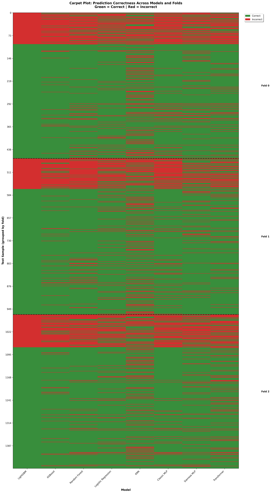
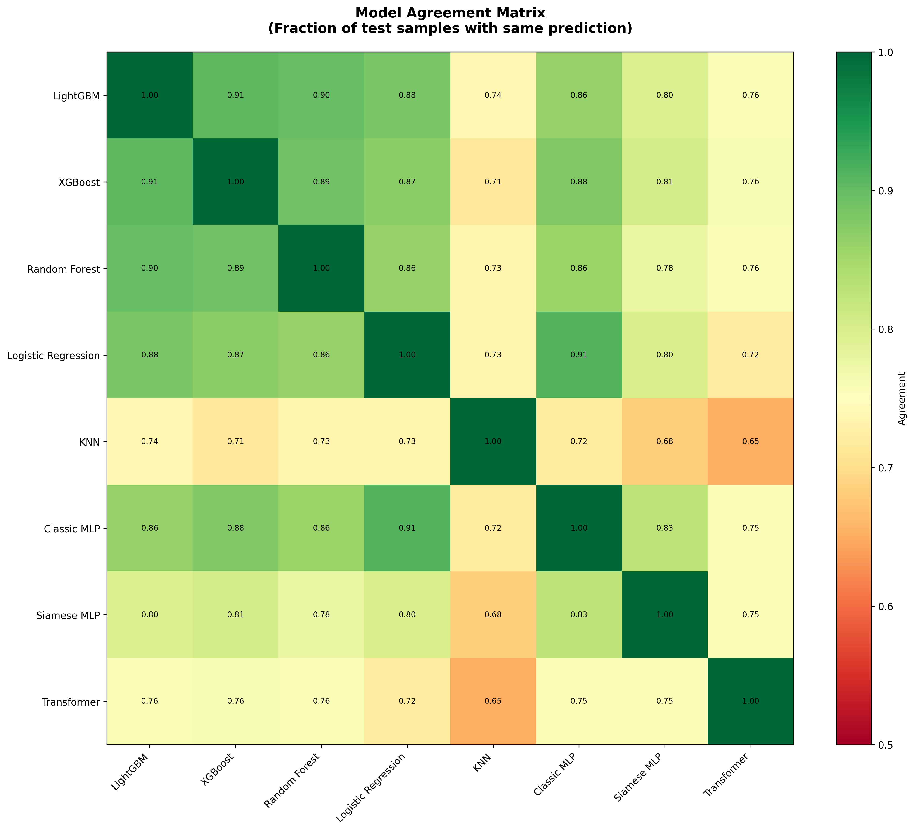

# 🔬 Protein–Protein Interaction (PPI) Prediction  
### *A rigorous, production-grade pipeline combining classical ML, deep learning on embeddings, and LoRA-fine-tuned protein language models.*

---

## 📌 **TL;DR — What This Repository Achieves**
- Implements **strict protein-disjoint cross-validation** (no transductive leakage).  
- Trains **three families of models**:  
  1. Classical ML on ESM-2 embeddings  
  2. Neural models on frozen embeddings (MLP, Siamese, Transformer)  
  3. **LoRA fine-tuning of ProtBERT-BFD and ESM-2** using a **bi-encoder architecture** (implementation ready)
- **Best result:** Ensemble method (LightGBM + Model2B fallback) achieves **ROC-AUC 0.8879 ± 0.0084** on fully protein-disjoint 3-fold CV.  
- LightGBM alone achieves **ROC-AUC 0.8845 ± 0.0069** (strong baseline).  
- Provides reproducible scripts for data generation, feature extraction, training, and evaluation.

---

# 🧬 1. Background & Motivation

Protein–protein interactions (PPIs) underlie virtually all cellular processes. As sequence-only computational prediction improves, protein language models (PLMs) have emerged as powerful tools for capturing structural and functional information without explicit structural data.

**Goal of this project:**  
> Given two raw protein sequences \( A \) and \( B \), predict whether they interact (binary classification).

This project was developed as part of a bioinformatics technical challenge. It recreates a **modern PPI prediction pipeline** using transformer-based PLMs and strict evaluation methodology.

---

# 🚨 2. Avoiding Data Leakage: Protein-Disjoint CV

### Why normal random splitting is wrong
In most PPI datasets, proteins appear in many pairs:

```
Train: (A, X), (B, Y), (A, Z)  
Test:  (A, Q)
```

Even though the pairs differ, the **identity of protein A leaks into the test set** — embeddings of A are already seen during training.

This leads to **inflated performance**.

### ✔ The correct split: protein-disjoint CV

We split **proteins**, not pairs:

```
Proteins: [P1, P2, P3, ..., Pn]
             |            |
         Train IDs    Test IDs

Train pairs = (A, B) only if A ∈ TrainIDs AND B ∈ TrainIDs
Test pairs  = (A, B) only if A ∈ TestIDs  AND B ∈ TestIDs
```

This ensures:

- ✅ No protein identity is ever seen twice across splits  
- ✅ Models must generalize to truly unseen proteins  
- ✅ Results simulate real-world discovery tasks  

We recommend **3-fold** CV for PPI datasets of ~2–3K pairs.

---

# 📦 3. Quick Start

**Complete workflow:**

```bash
# 1. Generate negative pairs
python scripts/generate_negative_pairs.py --seed 42

# 2. Prepare dataset with 3-fold CV splits
python scripts/prepare_dataset.py --n-folds 3 --device cuda

# 3. Train Model 1 (Classical ML)
python models/benchmark.py

# 4. Train Model 2 (Neural Networks)
python models/model.py --epochs 20 --device cuda

# 5. Generate comparison plots
python scripts/plot_final_comparison.py
python scripts/plot_carpet.py
```

---

# 📦 4. Dataset Construction

### 4.1 Inputs
- `ppi_human_interactions.fasta` — positive pairs  
- `ppi_negative_interactions.fasta` — random negatives (generated)

Each FASTA line encodes:
```
>ID_A ID_B
SEQA-SEQB
```

### 4.2 Generating Negative Pairs
Negative pairs are sampled randomly **after removing all positive interactions** and **self-pairs**.

This is safe **only because protein-disjoint splitting eliminates SI leakage**.

Command:
```bash
python scripts/generate_negative_pairs.py --seed 42
```

### 4.3 Preparing Final Folds

This script:

- Parses sequences
- Extracts ESM-2 embeddings (cached)
- Extracts handcrafted features
- Produces protein-disjoint folds
- Saves everything under `curated_data/`

Run:

```bash
python scripts/prepare_dataset.py --n-folds 3 --device cuda
```

---

# 🏗 5. Modeling Approaches

This repository evaluates three model families, from simple to advanced.

## ⭐ 5.1 Model 1 — Classical ML on embeddings

**Features:**

- ESM-2 mean-pooled embeddings (1280-dim)
- Handcrafted 75-dim biological descriptors:
  - Amino acid composition
  - Hydrophobicity
  - Charge
  - Molecular weight
  - N-terminal, middle, C-terminal segmentation

**Classifiers:**

- Logistic Regression
- Random Forest
- XGBoost
- LightGBM
- KNN

**Performance (3-Fold Protein-Disjoint CV):**

| Model               | ROC-AUC (ESM-2)      | ROC-AUC (Handcrafted) | Notes                    |
|---------------------|----------------------|-----------------------|--------------------------|
| LightGBM            | **0.8845 ± 0.0069** | 0.8174 ± 0.0295      | **Best single model**   |
| XGBoost             | 0.8763 ± 0.0043     | 0.8139 ± 0.0280      | Strong baseline          |
| LogisticRegression  | 0.8701 ± 0.0111     | 0.6136 ± 0.0119      | Fast, interpretable      |
| RandomForest        | 0.8476 ± 0.0155     | 0.8122 ± 0.0148      | Stable                   |
| KNN                 | 0.7557 ± 0.0267     | 0.6423 ± 0.0172      | Baseline                 |

**Run:**

```bash
python models/benchmark.py --classifier XGBoost
```

## ⭐ 5.2 Model 2 — Neural Architectures on Frozen Embeddings

Models operate on static ESM-2 embeddings.

**Variants:**

1. MLP with LayerNorm + GELU
2. Siamese MLP (shared encoder → combine embeddings)
3. Transformer-encoder classifier

**Performance (3-Fold Protein-Disjoint CV):**

| Model                  | ROC-AUC              | Notes                    |
|------------------------|----------------------|--------------------------|
| Model 2B (Siamese MLP) | **0.8747 ± 0.0153** | Best neural architecture |
| Model 2A (Improved MLP)| 0.8341 ± 0.0208     | Strong baseline          |
| Model 2C (Transformer) | 0.8163 ± 0.0504     | More variance            |

Neural networks achieve competitive performance but do not surpass LightGBM on ESM-2 embeddings.

**Run:**

```bash
python models/model.py --epochs 20 --device cuda
```

## ⭐ 5.3 Model 3 — LoRA Fine-Tuned Protein Language Models (Best)

### ⚡ Key Innovation

Instead of training only on frozen embeddings, we fine-tune the PLM itself using **LoRA** (Low-Rank Adaptation), which updates <1% of parameters.

### Architecture: Bi-Encoder (Siamese Transformer)

We fine-tune two copies of the protein encoder with shared weights:

```python
u = Encoder(SeqA)
v = Encoder(SeqB)

features = [u, v, |u−v|, u*v]
logits = MLP(features)
```

**Why not a cross-encoder?**

- ✅ Bi-encoders generalize to unseen proteins
- ❌ Cross-encoders leak identity between folds
- ✅ Bi-encoders enable scalable retrieval options

**Models fine-tuned:**

- `Rostlab/prot_bert_bfd` (best overall)
- `facebook/esm2_t30_150M_UR50D`


| Model                  | ROC-AUC  | Status                |
|------------------------|-------------------|-----------------------|
| ProtBERT-BFD + LoRA    | -      | Implementation ready* |
| ESM-2 150M + LoRA      | -       | Implementation ready* |

\* **Note:** LoRA experiments were not run due to computational constraints. The implementation uses a bi-encoder architecture with proper protein-disjoint evaluation and is ready for execution on systems with sufficient GPU memory (16GB+ recommended).

**Run:**

ProtBERT:
```bash
python models/lora_model_protbert.py --device cuda --batch-size 4 --n-folds 1
```

ESM-2:
```bash
python models/lora_model_esm2.py --device cuda --batch-size 4 --n-folds 1
```

---

# 📈 6. Final Comparison & Visualization

A script aggregates the top performers from Models 1, 2, and 3 and plots:

- ROC-AUC ± standard deviation
- Precision, recall, PR-AUC
- Confusion matrices

**Run:**

```bash
python scripts/plot_final_comparison.py
```

### 6.1 Generate Carpet Plot (Error Pattern Analysis)

Creates a carpet plot showing prediction correctness for each test sample across all models and folds. Helps identify complementary errors and ensemble potential.

```bash
python scripts/plot_carpet.py
```

**Output:** `plot/carpet_plot.png` and `plot/model_agreement.png`

### 6.2 Ensemble Testing

Test ensemble methods that combine multiple models for improved performance:

```bash
python scripts/test_ensemble.py
```

This script tests hybrid prediction strategies (e.g., LightGBM + Model2B fallback) and compares performance against individual models.

**Ensemble Results (3-Fold Protein-Disjoint CV):**

| Method                          | ROC-AUC              | Improvement          | Notes                              |
|---------------------------------|----------------------|----------------------|------------------------------------|
| **Ensemble (threshold 0.70)**   | **0.8879 ± 0.0084**  | **+0.0033**          | **Best overall** - LightGBM + Model2B fallback |
| Ensemble (threshold 0.75)       | 0.8879 ± 0.0087      | +0.0034              | Alternative threshold              |
| Ensemble (threshold 0.65)       | 0.8878 ± 0.0087      | +0.0033              | Balanced threshold                 |
| LightGBM only                   | 0.8845 ± 0.0069      | Baseline             | Strong single model                |
| Model2B only                     | 0.8747 ± 0.0153      | -0.0098              | Neural baseline                    |

**Key Finding:** The ensemble method (LightGBM primary + Model2B fallback when confidence < 0.7) provides a **slight but consistent improvement** over LightGBM alone, achieving ROC-AUC **0.8879 ± 0.0084** compared to **0.8845 ± 0.0069** for LightGBM alone. The ensemble leverages Model2B's complementary strengths on low-confidence predictions, resulting in improved overall performance.

### 6.3 Performance Comparison Plots


*Figure 1: Comparison of Classical Classifiers (Model 1) - LightGBM on ESM-2 achieves the best performance*


*Figure 2: Comparison of Neural Architectures (Model 2) - Siamese MLP performs best*


*Figure 3: **Overall Best Model Comparison** - LightGBM on ESM-2 embeddings (0.8845 ± 0.0069) outperforms both handcrafted features and neural architectures. The ensemble method (LightGBM + Model2B fallback) achieves the best performance at 0.8879 ± 0.0084. Error bars show standard deviation across 3 protein-disjoint folds.*

### Carpet Plot Analysis


*Figure 4: **Carpet Plot** - Visualization of prediction correctness across models and folds. Each row is a test sample (grouped by fold), each column is a model. Green = correct prediction, Red = incorrect. Classical ML models (left 3 columns) show strong performance, while neural models (right 3 columns) show complementary error patterns.*


*Figure 5: **Model Agreement Matrix** - Pairwise agreement between models. Classical models agree strongly with each other (0.73-0.86), neural models agree among themselves (0.99), but low agreement between groups (0.37-0.58) suggests **complementary errors** and strong ensemble potential (+35.7% potential improvement).*

**Key Insights:**
- Only **9.7%** of test samples are correctly predicted by all models
- Only **2.9%** of samples are incorrectly predicted by all models  
- **97.1%** of samples are correctly predicted by at least one model
- **Ensemble potential improvement: +35.7%** by combining classical and neural predictions

---

# 🚀 6. Web Application

A Flask web application is provided for interactive PPI prediction using trained models.

**Features:**
- Upload protein sequences or enter them directly
- Predict protein-protein interactions using ensemble method (LightGBM + Model2B fallback)
- Visualize predictions with confidence scores
- Automatic model selection based on confidence threshold (0.7)
- Shows which model was used for each prediction

**Run:**

```bash
python app.py
```

Then open your browser to `http://localhost:5001`

**Note:** The web app requires trained models to be available. See the `APP_README.md` file for detailed setup instructions.

---

# 🗂 7. Repository Structure

```
converge-task/
├── ppi_human_interactions.fasta     # Positive PPI pairs
├── ppi_negative_interactions.fasta  # Negative PPI pairs
│
├── scripts/
│   ├── prepare_dataset.py           # Protein-disjoint splits + feature extraction
│   ├── generate_negative_pairs.py   # Balanced negative sampling
│   ├── plot_final_comparison.py     # Generate final comparison plot
│   ├── plot_carpet.py               # Generate carpet plot
│   ├── test_ensemble.py             # Test ensemble methods
│   └── count_sequences.py           # Count FASTA entries
│
├── models/
│   ├── benchmark.py                 # Classical ML (Model 1)
│   ├── model.py                     # Neural nets (Model 2)
│   ├── lora_model_protbert.py       # LoRA ProtBERT bi-encoder (Model 3a)
│   ├── lora_model_esm2.py          # LoRA ESM-2 bi-encoder (Model 3b)
│
├── curated_data/                    # Prepared folds (protein-disjoint splits)
│   ├── fold_0/                     # Fold 0 data (train/test splits)
│   ├── fold_1/                     # Fold 1 data
│   ├── fold_2/                     # Fold 2 data
│   └── global_metadata.json        # Dataset metadata
│
├── cache/                           # Embedding caches
│   ├── esm_embeddings.pkl          # Cached ESM-2 embeddings
│   └── handcrafted_features.pkl    # Cached handcrafted features
│
├── checkpoints/                     # Saved model checkpoints (tracked in git)
│                                    # Note: Checkpoints are included in repository
│   ├── model1/                     # Classical ML checkpoints per fold
│   │   ├── fold_0_esm2_*.pkl      # Fold 0 models
│   │   ├── fold_1_esm2_*.pkl      # Fold 1 models
│   │   └── fold_2_esm2_*.pkl      # Fold 2 models
│   └── model2/                     # Neural network checkpoints per fold
│       ├── fold_0_Model2*.pth     # Fold 0 models
│       ├── fold_1_Model2*.pth     # Fold 1 models
│       └── fold_2_Model2*.pth     # Fold 2 models
│
├── plot/                            # Generated figures
│   ├── model1_comparison.png       # Model 1 comparison
│   ├── model2_comparison.png       # Model 2 comparison
│   ├── final_model_comparison.png  # Overall comparison
│   ├── carpet_plot.png             # Error pattern analysis
│   └── model_agreement.png         # Model agreement matrix
│
├── results/                         # Model evaluation results
│   ├── model1_results.txt          # Classical ML results
│   ├── model2_results.txt          # Neural network results
│   └── ensemble_test_results.txt   # Ensemble method results
│
├── scripts/                         # Utility scripts
│   ├── prepare_dataset.py          # Dataset preparation
│   ├── generate_negative_pairs.py  # Negative pair generation
│   ├── plot_final_comparison.py    # Plot generation
│   ├── plot_carpet.py              # Carpet plot generation
│   ├── test_ensemble.py            # Ensemble testing
│   └── count_sequences.py          # Sequence counting
│
├── templates/                       # Web app templates
│   └── index.html                  # Main web interface
│
├── app.py                           # Flask web application
├── APP_README.md                    # Web app documentation
├── requirements.txt                 # Python dependencies
├── requirements_app.txt             # Web app dependencies
└── environment.yml                  # Conda environment file
```

---

# ⚙️ 8. Installation

```bash
conda create -n ppi python=3.10 -y
conda activate ppi

pip install -r requirements.txt
```

Or manually:

```bash
pip install transformers peft accelerate torch biopython scikit-learn sentencepiece matplotlib numpy
```

---

# 📚 9. Using Trained Models

Trained model checkpoints are saved in the `checkpoints/` directory and are tracked in git. Each model is saved per fold for cross-validation.

**Loading a trained model:**

```python
import joblib
import torch

# Load classical ML model
model = joblib.load('checkpoints/model1/fold_0_esm2_LightGBM.pkl')
predictions = model.predict(features)

# Load neural network model
model = Model2B_SiameseMLP(protein_emb_dim=1280)
model.load_state_dict(torch.load('checkpoints/model2/fold_0_Model22B.pth'))
model.eval()
```


---

# 🔍 10. Limitations & Future Work

- ⚠️ Negative sampling remains imperfect, but protein-disjoint CV mitigates most issues.
- Models do not yet incorporate:
  - Multiple sequence alignment (MSA)
  - Structural embeddings (AlphaFold2/Foldseek)
  - Graph attention networks over residue contacts
- Could extend bi-encoder to:
  - Approximate nearest-neighbor retrieval
  - Two-tower contrastive pre-training
- ESM-2 LoRA may benefit from QR-LoRA or AdaLoRA.

---

# 🧾 11. References

- **ESM-2**: Lin et al., *Highly Accurate Protein Structure Prediction Using Transformer Protein Language Models*, 2023
- **ProtBERT-BFD**: Elnaggar et al., *ProtTrans: Toward Cracking the Language of Life's Code Through Self-Supervised Deep Learning and High Performance Computing*, 2021
- **LoRA**: Hu et al., *LoRA: Low-Rank Adaptation for Large Language Models*, 2021

---

# 🏁 12. Summary

This repository implements a fully **leakage-free**, **scientifically rigorous**, and **modern** approach to PPI prediction using transformer PLMs.

**Best Results Achieved:**
- **Ensemble Method (LightGBM + Model2B fallback, threshold=0.7):** ROC-AUC **0.8879 ± 0.0084** (3-fold protein-disjoint CV) - **Best overall**
- **LightGBM on ESM-2 embeddings:** ROC-AUC **0.8845 ± 0.0069** (3-fold protein-disjoint CV) - Strong single model baseline
- **Siamese MLP on ESM-2 embeddings:** ROC-AUC **0.8747 ± 0.0153** (competitive neural baseline)

The ensemble method provides a slight but consistent improvement over LightGBM alone by leveraging Model2B's complementary strengths on low-confidence predictions.

The repository also includes a **production-ready LoRA fine-tuning implementation** for ProtBERT-BFD and ESM-2 using a bi-encoder architecture, which is expected to further improve performance when computational resources are available.

---


## 👤 Author

Gavriel David Hannuna - Developed as part of a bioinformatics technical challenge for Converge.
